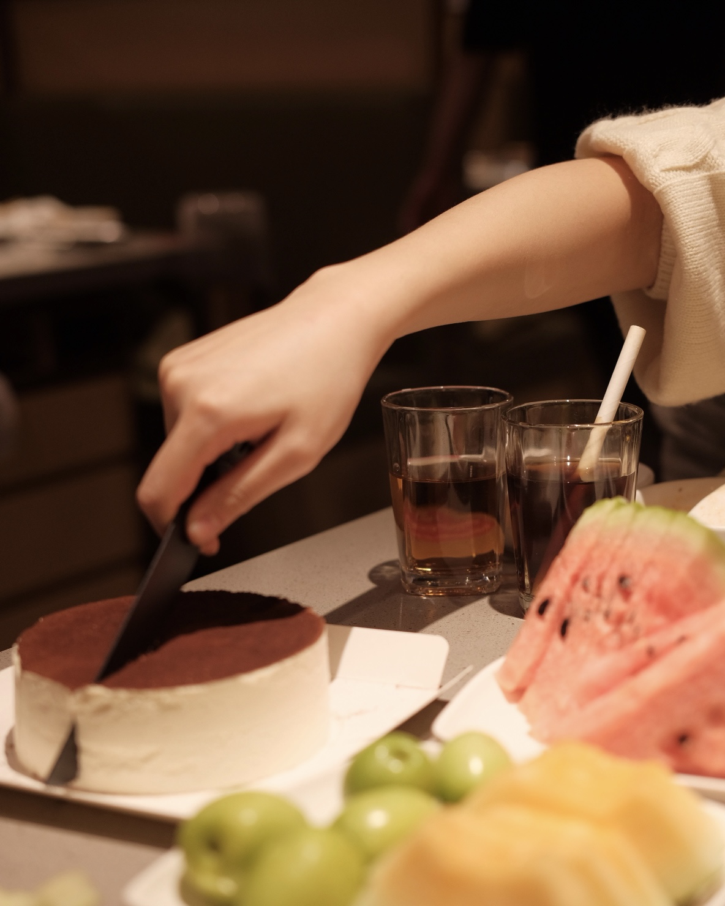

This is Rey's website that can't be put on a resume.

## Foods

Since this is not going to be showed in Rey's resume, Rey decided to show you some of her favourite foods, because she's having some terrible homesick recently, mainly on foods.

 
Here's a sentence in the most beautiful language in the universe that says: "-Are you feeling painful right now? - Don't worry, there will be hash browns queueing up to love u."

## Some personal information

Here's some boooooring information about Rey: [Resume](resume.html)

## Some plots

This is a dashboard about the inspection of some NYC restaurants created by Rey: [Inspection of NYC restaurants](plots.html) 

## Surprise

Just in case we wanna see more, here's some food Rey has had in NYC.

Oh my gosh they looked so bland.
